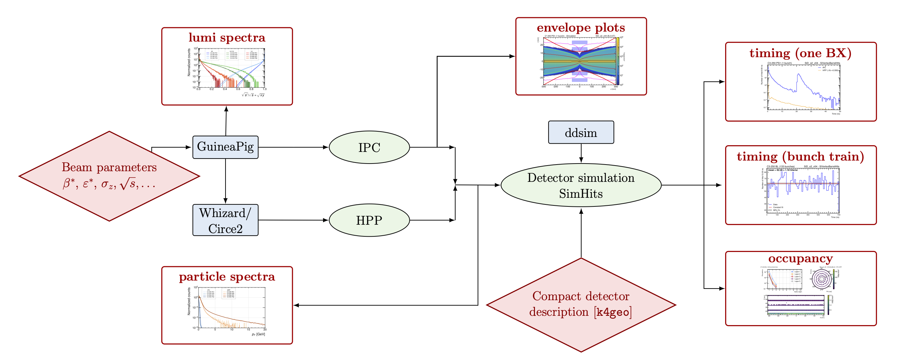

# Beam-Beam Backgrounds for the Cool Copper Collider

Companion codebase for the paper **Beam-Beam Backgrounds for the Cool Copper Collider** by Dimitrios Ntounis, Caterina Vernieri, Lindsey Gray, Elias Mettner, Emilio A. Nanni, and Tim Barklow.  
External links: [arXiv (coming soon)](https://arxiv.org/abs/TBD) | [Journal submission (pending)](https://doi.org/placeholder)

The background-production pipeline illustrated in `Simulation_flowchart.png` / `Simulation_flowchart.pdf` proceeds as follows:
- Beam parameters (beta*, epsilon*, sigma_z, sqrt(s), ...) seed **GUINEA-PIG**, producing luminosity spectra, particle ntuples, and per-seed bunch trains for incoherent pair creation (IPC).
- The same beam description drives **Whizard/Circe2**, yielding hadron photoproduction (HPP) events matched to the C^3 running scenarios.
- IPC and HPP samples are the two physics stages in the center column: IPC studies focus on pair envelopes and raw particle spectra, while HPP provides the gg->hadrons contribution with full event records.
- Both backgrounds are transported through **ddsim** with the SiD geometry from `k4geo`, generating detector-level SimHits.
- Downstream analyses consume the ddsim outputs to derive timing (single bunch vs. full train), occupancy, and per-subdetector hit-rate summaries; envelopes and spectra are archived alongside the detector-level products.

## Repository structure

- `IPC/`
  - `GuineaPig_ddsim/` - Slurm payloads, steering files, and helper scripts for running GUINEA-PIG on S3DF, converting pairs into EDM4hep via `ddsim`, and merging per-seed outputs. All scripts assume CVMFS-based Key4HEP environments and should be templated for other sites.
  - `pair-envelopes/` - Python utilities (Numba-accelerated) to propagate IPC e+/e- tracks as helices, accumulate r-z/x/y histograms, derive percentile envelope curves, and overlay detector reachability boundaries. Includes caching, parallel processing, and ridge-comparison tooling.
- `HPP/` - Workflow for hadron photoproduction: Whizard/Circe2 steering cards, S3DF batch wrappers, and plotting scripts for comparing Circe-produced spectra to GUINEA-PIG luminosity files. Instructions cover building Whizard, staging circe inputs from concatenated GUINEA-PIG runs, generating `.slcio`/EDM4hep samples, and feeding them into `ddsim`.
- `SimHits/` - An EDM4hep timing and hit-rate analysis suite. Contains Python scripts that glob detector outputs, build cached histograms, extract constant-fit rates, and publish the timing figures used in the paper (one-BX vs. train, IPC vs. HPP separation, and subdetector overlays).
- `occupancy/` - `dd4hep_hit_analysis_framework`, a modular package for decoding SiD cell IDs, mapping geometry, and computing hit occupancies. Provides reusable detector configuration classes, segmentation helpers, and command-line scripts/notebooks for layer-by-layer occupancy and time-bucket studies.
- `Simulation_flowchart.png` - Visual summary of the full simulation and analysis pipeline referenced above.

## Dependencies and licenses

- GuineaPig: https://gitlab.cern.ch/clic-software/guinea-pig - Released under the upstream license; review and comply with their terms.
- Whizard and Circe2: https://whizard.hepforge.org - Distributed under their respective open-source licenses as described by the project.
- Key4HEP: https://github.com/key4hep - Bundles multiple tools; follow the licenses referenced in the Key4HEP documentation and component repositories.

Each subtree retains its original README with site-specific setup notes, so consult those documents before launching large-scale production or modifying batch payloads.
